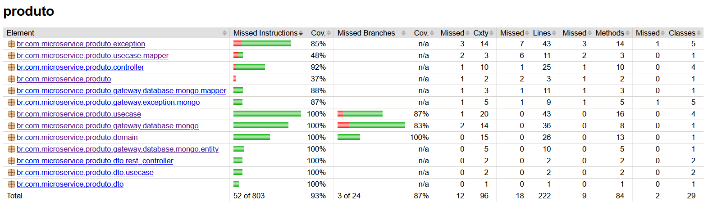

# Tech Challenge 04 - Produto

- Introdução
- Funções
- Tecnologias
- Infraestrutura Cloud
- Instalação
- Banco de dados
- Fluxo principal
- API
- Qualidade de software

***

## Introdução

Esta aplicação é parte de um sistema de gerenciamento de pedidos e estoque com o framework Springboot. Este microsserviço se trata se um CRUD para os produtos. 

O projeto pode ser acessado em: https://github.com/eduardoesr/micro-produto-clean-arch

***

## Funções

* Cadastrar produtos.
* Listar produtos, com endpoint próprio para obter os produtos por uma lista de Skus.
* Atualizar produtos.
* Apagar produtos.

***

## Tecnologias

* Springboot: Framework web
* Maven: Gerenciador de dependências
* Swagger: Documentação e interface para testes
* RabbitMQ: Broker de mensagens
* MongoDB: Banco de dados NoSQL

***

## Instalação

* Instalar Docker Desktop.
* Baixe os arquivos repositório. `https://github.com/eduardoesr/micro-produto-clean-arch`.
* Entre na pasta do repositório. `cd micro-produto-clean-arch`.
* Execute o projeto com o Docker Compose.
    * Utilize este comando no terminal: `docker-compose up --build`.
 
Este docker-compose irá rodar o microsserviço do Springboot com o banco de dados em MongoDB.

O Swagger pode ser acessado diretamente em `http://localhost:8083/swagger-ui/index.html`.

***

## Banco de dados

Entidade Produto

| Campo  | Descrição                                                                        |
|----------|--------------------------------------------------------------------------------|
| Id       | Identificador único do produto                                                 |
| Nome     | Nome do produto                                                                |
| Sku      | Código SKU único do produto, valor único entre serviços                        |
| Preço    | Preço do produto                                                               |

***

### Cadastrar produto `POST /create-produto`
Exemplo de envio:
  ```
{
    "nome": "Smartphone Galaxy S23",
    "sku": "SAMS-S23-128GB",
    "preco": 4999.99
}
  ```

### Apagar produto `DELETE /delete-produto/{id}`

### Listar todos os produtos `GET /produto/`
Exemplo de envio:
```
{
  "page": 0,
  "size": 10
}
 ```

### Encontrar produto por id `GET /produto/{id}`

### Listar todos os produtos `GET /produto/listar?sku=sku1&sku=sku2`

### Atualizar produto `PUT /update-produto/{id}`
Exemplo de envio:
  ```
{
    "nome": "Smartphone Galaxy S23",
    "sku": "SAMS-S23-128GB",
    "preco": 4999.99
}
  ```

***

## API

### Produto

| Método  | URL                            | Ação                                                        |
|---------|--------------------------------|-------------------------------------------------------------|
| POST    | /create-produto                | Cria um novo produto.                                       |
| DELETE  | /delete-produto/{id}           | Apaga produto pelo ID.                                      |
| GET     | /produto                       | Obtém todos os produtos.                                    |
| GET     | /produto/{id}                  | Obter produto pelo ID.                                      |
| GET     | /produto/listar                | Listar produtos conforme sku.                               |
| PUT     | /update-produto/{id}           | Atualizar um produto pelo ID.                               |

***

## Qualidade de software

### Testes

Foi realizado testes na API, buscando alcançar mais de 80% de cobertura

<div align="center">
    
</div>
